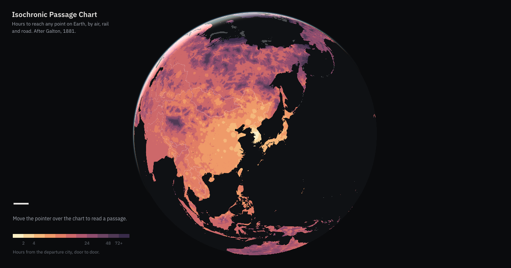

<div align="center">

# Isochronic Passage Chart

**How long it takes to reach anywhere on Earth, door to door, from the cities in `data/origins.toml`.** The count is not repeated here: it has been wrong in this file twice, and `dist/index.json` is the only place that knows what was actually built.

[](https://worldmap.atik.kr/)


[**Open the map**](https://worldmap.atik.kr/) · [How it is built](#development) · [Data sources](#data-sources-and-attribution)



</div>


A pipeline for building global travel-time isochrone maps from open geodata.

It computes expected door-to-door travel time from each departure city in
`data/origins.toml` to every land cell on Earth (H3 resolution 6, refined to 7
in dense regions), by air, rail, ferry and road, and emits one PMTiles band
set plus binary time, airport, mode and rail-station arrays per departure.

## Development

```bash
uv sync
uv run ruff check .
uv run pytest                              # the gate; -m "not integration" for a fast loop
uv run transport-maps build-all            # every origin -> dist/ (one build per dist/ at a time)
uv run transport-maps build-all --only seoul,tokyo   # a smoke test through every gate; index.json untouched
uv run transport-maps build-all --skip-existing     # resume a build that died: rebuild only unfinished origins
uv run transport-maps build-all --offline  # read every raw input from data/cache, ask no upstream
uv run transport-maps reindex              # rewrite dist/index.json from the artifacts on disk
uv run transport-maps assets               # places.json, airports.json, borders.json -> dist/
uv run python scripts/check_dist.py        # is dist/ consistent enough to deploy?
uv run python scripts/build_water_tiles.py # the coast, once -> dist/water.pmtiles
```

`assets` writes the three static JSON files the page loads beside the
per-origin arrays (`transport-maps assets airports.json` for one). They depend
on no graph and no origin, so `build-all` does not write them; rerun it when
the GeoNames, OurAirports or Natural Earth inputs change. It takes the same
build lock as `build-all` and `reindex`.

`--only` and `--limit` make a PARTIAL build: `index.json` is left untouched, but
`dist/hover_cells.bin` and the named origins under `dist/origins/` **are**
rewritten, so a smoke test against a published `dist/` mixes generations. Point
it at a scratch `dist/` unless you mean to replace those origins.

Each origin's files carry a completion record, `.progress/<slug>.json` beside
`origins/` (never deployed). It says "writing" from before the origin's first
file is replaced until after its last, then "complete" with every file's size,
keyed on the run's `inputsHash` (code by content, `calibration.toml`,
`origins.toml`, format constants) and a digest of the graph (the data inputs).
`--skip-existing` leaves alone an origin whose record is complete under the
current key with its files at the recorded sizes and builds the rest, so a run
that died is resumed with the same command plus the flag (`--exclude <mode>`
for a variant). The graph is rebuilt either way: skipping saves the per-origin
solves, not the graph build. `index.json` and a variant's `variant.json` are
written only once every origin is complete for the run, whichever run built it.
`scripts/check_dist.py` refuses an origin whose record still says "writing".

Every build first asks each upstream whether its raw input changed and
downloads what did (`sources/_fetch.py`): a conditional request per file
(ETag / Last-Modified, from a `<file>.meta.json` sidecar beside it in
`data/cache`) for OurAirports, Natural Earth, GRIP4, GeoNames and the water
polygons; Geofabrik's `state.txt` against the snapshot in each OSM extract's
header, re-extracting a region more than `TRANSPORT_MAPS_OSM_MAX_AGE_DAYS`
(default 7) behind through `scripts/osm_fixed_links.sh` / `osm_rail.sh` with
`OSM_REPLACE=1`; and the Wikipedia crawl, whose articles are refetched once a
day old (Wikidata codes once a month old). A failed check keeps the cached
copy and says so; a missing input with no copy fails. Every derived cache keys
on its input's content, so a changed input rebuilds exactly what depends on
it, and `index.json` records what was read under `inputs`. `--offline` (or
`TRANSPORT_MAPS_OFFLINE=1`) asks nothing and reads the cache as it is -- use it
to reproduce a past build, and with `--skip-existing` to resume one on the
inputs it read.

`reindex` writes `index.json` and nothing else. It is for the case where a build
outlives a change to the index emitter: the parent process writes `index.json`
at the end of the run using the module it imported at the start, so a sixteen-hour
build can publish an index that predates its own artifacts. It takes the build
lock, lists only origins whose whole file set is present and the right length,
and carries the previous index's build identity forward rather than stamping the
current checkout.

The bands are painted one cell past the shore and the static `water.pmtiles`
layer, built once from OpenStreetMap water polygons, cuts them back to the real
coastline on the page. It is not produced by `build-all`; rebuild it when the
water polygons change -- the script checks them against the upstream itself.

## Data sources and attribution

This project redistributes data derived from the sources below. Anything built
from `dist/` must carry the same credits; `dist/index.json` ships them in its
`attribution` block for exactly that purpose.

| Source | Licence | Used for |
| --- | --- | --- |
| [Wikipedia](https://en.wikipedia.org/) | CC BY-SA 4.0 | airline route network, from 'Airlines and destinations' sections |
| [Wikidata](https://www.wikidata.org/) | CC0 1.0 | resolving destination articles to IATA codes (property P238) |
| [OurAirports](https://ourairports.com/data/) | Public Domain | airport locations, sizes and scheduled-service status |
| [Natural Earth](https://www.naturalearthdata.com/) | Public Domain | 1:10m land polygons defining the H3 cell universe; country borders; populated places behind the urban mask |
| [GRIP4 (Global Roads Inventory Project)](https://www.globio.info/download-grip-dataset) | CC0 1.0 | road-density rasters setting per-cell ground speed |
| [OpenStreetMap](https://www.openstreetmap.org/copyright) | ODbL 1.0 | coastlines drawn on the map (water polygons via [osmdata.openstreetmap.de](https://osmdata.openstreetmap.de/)); rail route relations and ferry ways; upstream source of the GRIP4 road network |
| [GeoNames](https://www.geonames.org/) | CC BY 4.0 | departure cities and the place names under the cursor (cities15000) |
| [HydroLAKES](https://www.hydrosheds.org/products/hydrolakes) | CC BY 4.0 | lake outlines drawn on the map (Messager et al. 2016) |
| [adsb.lol](https://adsb.lol/) | ODbL 1.0 | observed flights behind the fitted cruise speed and climb/descent penalty |

OpenStreetMap enters three ways: rail route relations and ferry ways
(`route=ferry`) are parsed from Geofabrik PBF extracts (`sources/osm.py`), the
coastline layer is built from OSM water polygons (`emit/water.py`), and GRIP4
is itself compiled from many road datasets **including OpenStreetMap**, so the
road-density rasters that set every ground speed are downstream of it as well.

GRIP4 asks to be cited as: Meijer, J.R., Huijbregts, M.A.J., Schotten, C.G.J.
and Schipper, A.M. (2018): Global patterns of current and future road
infrastructure. *Environmental Research Letters* 13-064006.

No commercial flight data (schedules, frequencies or positions) is used
anywhere in this pipeline; `tests/test_licence_firewall.py` checks that no
provider fingerprint reaches `dist/`. One commercial service is used during
**calibration only**: `scripts/calibrate_ground.py` samples driving times from
Google Routes and fits four of the six per-road-class speeds (classes 1-4)
and the urban factor, which `calibration.toml` (`[ground]`, `[urban]`) records
with their provenance and `graph/ground.py` and `sources/urban.py` read.
Roadless terrain and local roads keep published-figure defaults: for roadless
terrain the fit returned a negative time per kilometre (a reciprocal of
-0.00978 h/km, about -102 km/h, from 2,272 km across 55 journeys), which the
fit's sign filter refuses, and local roads drew 116 km across four journeys,
which its support guard refuses. `graph/ground.py` says which is which
at the constant itself, as CLAUDE.md's calibration rule requires. The sampled durations stay in
`data/build/` (gitignored) and nothing from them reaches `dist/`.

## Licence

The code in this repository is released under the [MIT License](LICENSE). That
covers the code only: the maps in `dist/` are derived from the data sources
above and carry their licences, notably OpenStreetMap's ODbL and the CC BY /
CC BY-SA attribution terms.
